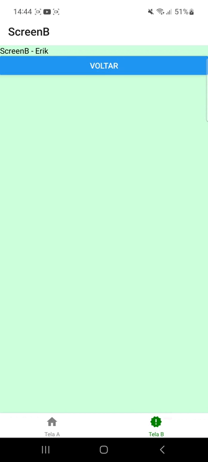
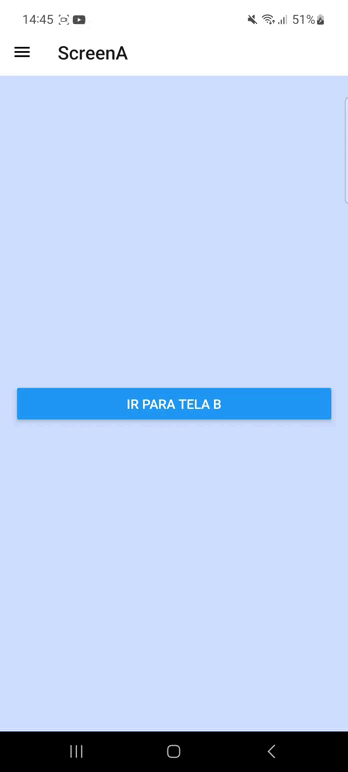

## :computer: Projeto

Projeto para aprender sobre os principais tipos de navegação dentro do ambiente mobile, sendo eles Stack, Tab e Drawer. Cada tipo de navegação consegue resolver uma necessidade diferente para cada app.

<table>
  <thead>
    <tr>
      <th>Tipo</th>
      <th>Vídeo</th>
    </tr>
  </thead>
  <body>
    <tr>
      <td>Stack</td>
      <td align="center">
        
      </td>
    </tr>
    <tr>
      <td>Tab</td>
      <td align="center">
        
      </td>
    </tr>
    <tr>
      <td>Drawer</td>
      <td align="center">
        
      </td>
    </tr>
  </body>
</table>

## :rocket: Tecnologias

Foram usadas as seguintes tecnologias:

- [React Native](https://reactnative.dev)
- [Expo](https://expo.dev)
- [React Navigation](https://reactnavigation.org)
